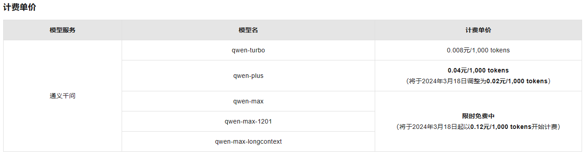
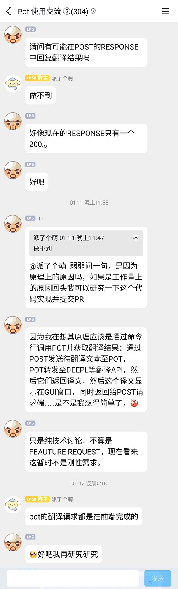

OneYi
---
一个翻译接口, 对接多个平台, one译.

把多个翻译(AI)平台的API搞成一个API, 
这样你就不用你自己去看各个平台的开发文档了,
只需要调用这一个接口就可以.


OneYi只有一个翻译功能
---

提交文字, 把文字翻译为指定的语言, 然后再返回给用户.

除此以外, 没别的功能.


## OneYi使用的语言

- Nodejs
- CommonJS 规范


支持平台
---
- 小牛翻译 https://niutrans.com/documents/contents/trans_text#accessMode
- 火山翻译 https://github.com/volcengine/volc-sdk-nodejs/blob/main/README_zh.md
- 百度翻译 https://fanyi-api.baidu.com/doc/21
- 阿里翻译 https://help.aliyun.com/zh/machine-translation/developer-reference/api-alimt-2018-10-12-translategeneral
- 智谱AI https://open.bigmodel.cn/dev/api#sse_example
- 有道翻译 https://ai.youdao.com/DOCSIRMA/html/trans/api/wbfy/index.html
- Moonshot https://platform.moonshot.cn/docs/api-reference
- 通义千问 https://help.aliyun.com/zh/dashscope/developer-reference/api-details
- 百度千帆 https://cloud.baidu.com/doc/WENXINWORKSHOP/s/clntwmv7t


为啥没有某讯
---

阿里送新用户一百万token, 某讯送十万, 

十万用不了几次, 可能用着用着就欠费了, 

以防万一, 我就没加, 

我要处理的excel的字数还是不少的, 我怕刷欠费喽,

得不偿失, 干脆不加.


警告
---
任何平台的**秘钥**都不应当暴露给任何人, 否则你会丢钱, 

因为平台大部分都是后付费的, 
你的秘钥暴露给别人, 别人一天刷个几十万token , 你就亏大了.


各平台价格
---

[通义千问如何计量计费和查看账单_模型服务灵积(DashScope)-阿里云帮助中心 (aliyun.com)](https://help.aliyun.com/zh/dashscope/developer-reference/tongyi-thousand-questions-metering-and-billing?spm=a2c4g.11186623.0.0.6d1b12b0XquOme)

以通义千问为例, 0.12元 / 1000tokens



一个字符我们就当作是 2 个tokens, 

800字的小作文值多少钱
---

800 * 2 *0.12 / 1000 = 0.192

800字的作文值 2 毛钱, 

但是, 作文都不是一次性生成的, 通常要改几遍, 

而且, 一般都是连着历史记录一起发过去的, 那么服务端收到的就不是800个字符了, 

而是 `800 + 800 * 2 + 800 * 3 + 800 * 4`


算数我也不太会, 下面是AI的回答

```
等差数列。每一项与前一项的差是一个固定的数值，即800。

这个数列的首项是800，公差（即每一项与前一项的差）是800。我们需要计算从800加到800 * 10的和。

等差数列的求和公式是：

\[ S_n = \frac{n}{2} [2a_1 + (n - 1)d] \]

其中，\( S_n \) 是前n项的和，\( a_1 \) 是首项，\( d \) 是公差，\( n \) 是项数。

在这个例子中，首项 \( a_1 \) 是800，公差 \( d \) 也是800，项数 \( n \) 是10（因为从800加到800 * 10）。

将这些值代入公式中，我们得到：

\[ S_{10} = \frac{10}{2} [2 \times 800 + (10 - 1) \times 800] \]

\[ S_{10} = 5 [1600 + 9 \times 800] \]

\[ S_{10} = 5 [1600 + 7200] \]

\[ S_{10} = 5 \times 8800 \]

\[ S_{10} = 44000 \]

所以，按照这个规律从800加到800 * 10的最终和是44000。
```


44000 * 2 *0.12 / 1000 = 10.56, 

一篇800字的小作文, 修改十次的话, 就得10块钱, 

就这还是在使用AI顺顺利利的情况下, 

不顺利的话, 要花的钱就更多了, 


如果你的秘钥被别人看到, 别人就盗用你的秘钥, 

平台又是后付费, 就是先使用后扣钱, 

这扣的都是你的钱啊, 


所以, 你的秘钥一定不要给任何人看到, 

除了你自己, 就连爸妈都不给他们看.


---


OneYi使用方法
---

1. 设置默认的翻译平台

   1. 打开`config/default.ini`, 修改默认平台的名字 `defaultProvider = 百度翻译`
   2. 所有平台的名字可以在这个文件查看 `config/prod.ini`, 小牛翻译, 火山翻译, 通义千问 等等
2. 设置自己的秘钥

   1. 秘钥都是你自己去平台申请的
   2. 你用哪个平台, 就去文件`config/prod.ini`, 设置那个平台的秘钥, 把 `xxxxxxxxxx` 修改为你的秘钥
   3. 如果你那个平台token用完了, 建议你把秘钥直接删掉, 或者新建一个秘钥,  这样别人肯定就刷不了你刚才的秘钥了.
3. 启动程序

   1. 安装依赖, 在项目的根目录运行, `npm install --registry=https://registry.npmmirror.com`
   2. 在终端输入 `npm start`, 回车
   3. 程序就会监听 `http://localhost:36315/`
   4. 端口可以在文件中修改 `config/default.ini`
4. 提交请求
   1. 只支持Post

   2. 只有一个路由  `/translate`

   3. body必须是json

   4. `codeExample` 文件夹中有发送请求的例子

5. 请求体, 1和2是必填字段, 3是可选字段, 三个类型都是字符串
   1. text
   2. targetLanguage
   3. sourceLanguage

6. 语言代号, 统一使用 `config/default.ini` 中的代号, 语言代号都是两三个字母的缩写
7. 响应体
   1. 肯定有 `success` 字段, 布尔值
   2. 翻译成功的话, 就读取 `data.text` 字段, 
   3. 翻译失败的话, 就读取错误消息, `error.message`


## 发送请求

```js
var axios = require("axios");
var data = {
  text: "an angry man say: who care, get out, out",
  targetLanguage: "zh",
  sourceLanguage: "en"
};
var config = {
  method: "post",
  url: "http://localhost:36315/translate",
  headers: {
    "Content-Type": "application/json"
  },
  data: data
};
axios(config)
  .then(function (response) {
    console.log(JSON.stringify(response.data));
  })
  .catch(function (error) {
    console.log(error);
  });

```


为啥要写OneYi
---

我开始打算批量翻译英文的prompt, 几百几千条的那种, 这肯定不能手动搞啊, 必须上程序,

写程序费时间, 所以我不想写, 我就去网上找, 

我找啊找, 找到一个, [Pot](https://github.com/pot-app/pot-desktop)


这软件支持好多个翻译平台呢? 这把我给整高兴的, 

我看他的 [文档](https://pot-app.com/docs/invoke.html), 还支持外部调用, 

使用方法也非常简单

```
curl "127.0.0.1:60828/selection_translate"
```

我当即就Ctrl + C, Ctrl + V, Enter, 出现英文转成中文的弹框了, 真的能用诶, 棒棒棒


可是我左调右调, 终端里的日志, 就是不出现翻译后的结果, 

难道我方法错了? 


我又看了几遍文档, 几番测试, 终端里就是没有打印翻译后的内容, 

不行, 我得去群里问问, 


群我老早就加了, 现在群里的人都不太爱说话, 

我看没人发言, 我也就没在qq群发问, 

我直接去搜qq群的聊天记录, 还真有人问过同样的问题



这下希望破灭了, 但是我还不死心, 我又去网上找别的软件, 

可找了好久, 没找到那种, 我只发一个post文字的请求, 就返回翻译后的内容, 

找了一遍, 没找到比Pot更好的软件爱你

可是Pot离我的想法只差一点点, 就是在响应中返回翻译后的内容,


所以, 我就有了做OneYi的想法, OneYi就一个功能, 就是接收一个翻译请求, 然后返回翻译后的结果, 

用户只需要知道一个OneYi接口, 他就可以任意切换各个平台去翻译内容, 

每个平台几乎都有免费额度, 就来回换, 


而且这些平台的翻译功能, 几乎都是24小时刷新字符数量的, 

所以你使用的时候, 要先看看你还剩下多少字符, 

如果免费的字符数不多了, 那就换别的平台,

万一刷的超过免费字符数, 你掏钱的时候就等着心疼吧.


## OneYi 交流QQ群

827993256


